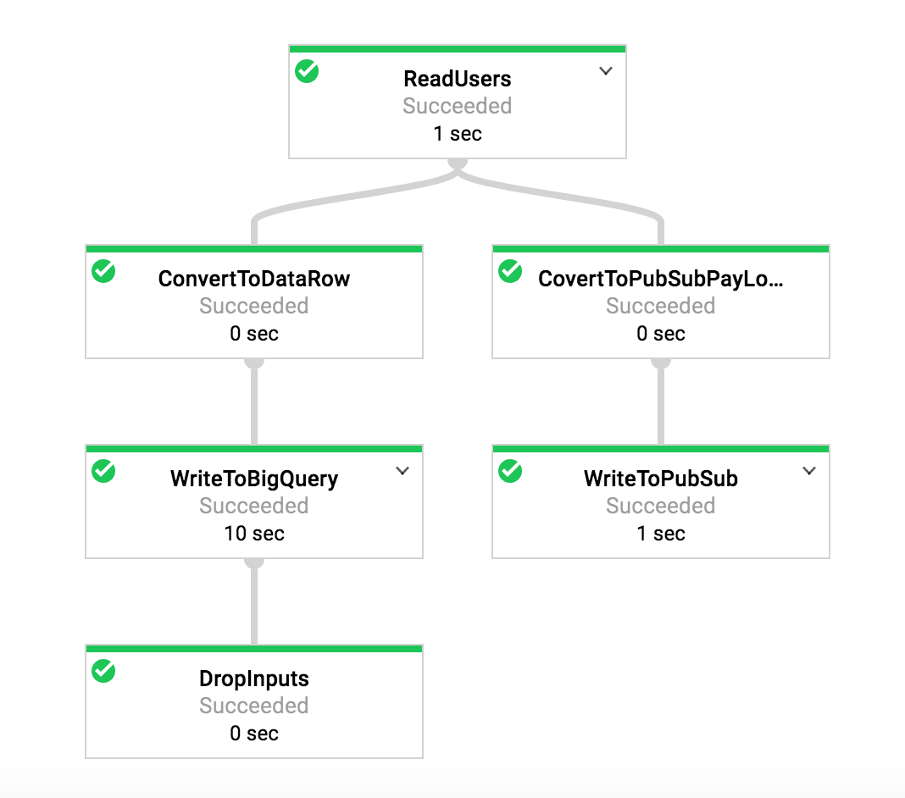

# multi-storage
An implementation of "Pushing data to multiple storage locations" pattern of [Guide to common Cloud Dataflow use-case patterns](https://cloud.google.com/blog/big-data/2017/06/guide-to-common-cloud-dataflow-use-case-patterns-part-1).



## What is this
* Generate toy data
* Write data to multi-storage
	* write to BigQuery
	* write to PubSub 	

## How to Run
Run the program:  

* Please substitute appropriate values for `__YOUR_DATASET__`, `__YOUR_TABLE__`, `__YOUR_TOPIC__`, `__YOUR_PROJECT__` and `__YOUR_TEMP_LOCATION__`. 

* Note that you should create the PubSub topic beforehand.

```
$ mvn compile exec:java -Dexec.mainClass=com.kenjih.beam.examples.MultiStorage \
     -Dexec.args="--runner=DataflowRunner --bigQueryDataset=__YOUR_DATASET__ --bigQueryTable=__YOUR_TABLE__ --pubSubTopic=__YOUR_TOPIC__ --project=__YOUR_PROJECT__ --tempLocation=__YOUR_TEMP_LOCATION__" -Pdataflow-runner
```

## Reference
* [Guide to common Cloud Dataflow use-case patterns](https://cloud.google.com/blog/big-data/2017/06/guide-to-common-cloud-dataflow-use-case-patterns-part-1)
