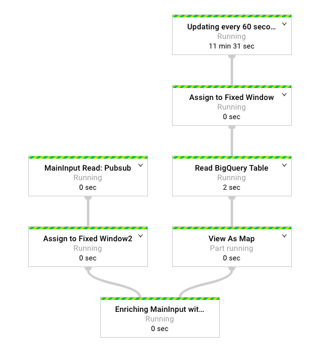

# slowly-changing-lookup-cache
An implementation of "Pattern: Slowly-changing lookup cache" pattern of [Guide to common Cloud Dataflow use-case patterns](https://cloud.google.com/blog/big-data/2017/06/guide-to-common-cloud-dataflow-use-case-patterns-part-1).

## What is this

* Reading a streaming data from Cloud PubSub as `mainInput` for pipeline. 
* Enriching `mainInput` data with `sideInput`.
    - In this example, both inputs are `string`, we merging these two and showing as an log.
* `sideInput` can be any external resources. For the convenience, reading records of BigQuery table us java client.
* `sideInput` is a slow changing data. We are updating this every `N` seconds. 



In this example, receiving ID of the store's product from Cloud PubSub. 
We want to enrich these elements with the description of the product name stored in a BigQuery table.

## How to Run

Please substitute appropriate values

- `${GOOGLE_PROJECT}`: Google Project name.
- `${PUBSUB_TOPIC_NAME}`: Cloud Pubsub Topic name.
- `${BQ_PROJECT_ID}`: BigQuery Table's Project id.
- `${BQ_DATASET_ID}`: BigQuery Table's Dataset id.
- `${BQ_TABLE_ID}`: BigQuery Table's Table id.
- `${RUNNER}`: Beam Runner name. ex: DirectRunner, DataflowRunner
- `${INTERVAL_SECONDS}`: Frequency of the updating SideInput of the Pipeline.

### Prepare resources

1. Creating Pubsub Topic
```bash
gcloud --project ${GOOGLE_PROJECT} pubsub topics create ${PUBSUB_TOPIC_NAME}
```

2. Creating BigQuery Table with some datas
```bash
# prepare sample data
cat <<EOF > store_data.csv
ABC100,sports and outdoors
ABC101,furniture
ABC102,handmade
ABC103,grocery
ABC104,fashion
EOF

# load data to BQ
bq --project_id ${BQ_PROJECT_ID} --dataset_id ${BQ_DATASET_ID} \
    load --source_format=CSV --replace ${BQ_TABLE_ID} store_data.csv category_id:STRING,description:STRING
```

### Run the Beam Pipeline

```bash
# set project
gcloud config set project ${GOOGLE_PROJECT}

# Run the Beam Pipeline
mvn compile exec:java \
  -Dexec.mainClass=com.byam.beam.examples.Main\
  -Dexec.args="\
  --runner=${RUNNER} \
  --project=${GOOGLE_PROJECT} \
  --topic=projects/${GOOGLE_PROJECT}/topics/${PUBSUB_TOPIC_NAME} \
  --intervalSeconds=60 \
  --bigQueryProject=${BQ_PROJECT_ID} \
  --bigQueryDataset=${BQ_DATASET_ID} \
  --bigQueryTable=${BQ_TABLE_ID} \
  "
```

### Test the pipeline

Open the new terminal, send message (product id) to Cloud Pubsub. 

```bash
# ex: ABC104
gcloud --project ${GOOGLE_PROJECT} pubsub topics publish ${PUBSUB_TOPIC_NAME} --message ABC104
```

Check the log of the beam pipeline, you would see product id and product description with map size.
```bash
[Map size]: 5
[Stream] category id: ABC104 [Enriching Data] description: fashion
```

At this point, our sideInput(BigQuery table) has only 5 records. We will update BigQuery table, adding new product of `ABC105`.
```bash
# prepare sample data
cat <<EOF > store_data.csv
ABC100,sports and outdoors
ABC101,furniture
ABC102,handmade
ABC103,grocery
ABC104,fashion
ABC105,new ones
EOF

# load data to BQ
bq --project_id ${BQ_PROJECT_ID} --dataset_id ${BQ_DATASET_ID} \
    load --source_format=CSV --replace ${BQ_TABLE_ID} store_data.csv category_id:STRING,description:STRING
```

After a `${INTERVAL_SECONDS}` seconds later, send a PubSub message (new record ABC105), and check the log.
```bash
gcloud --project ${GOOGLE_PROJECT} pubsub topics publish ${PUBSUB_TOPIC_NAME} --message ABC105
```

If everything works, you would see similar to following. It show newly added product.
```bash
[Map size]: 6
[Stream] category id: ABC105 [Enriching Data] description: new ones
```

## Notes

* We can't read BigQuery table from ParDo using Beam reader. Instead using [BigQuery Rest API](https://cloud.google.com/bigquery/docs/reference/rest/v2/jobs/query) or [BigQuery Client Libraries would work](https://cloud.google.com/bigquery/docs/reference/libraries#client-libraries-install-java).
    - [Use a pcollection as input of another pcollection](https://stackoverflow.com/questions/48650127/use-a-pcollection-as-input-of-another-pcollection/48653161#48653161)

* Use fixed window for sideInputs. 
    - [Beam uses the window(s) for the main input element to look up the appropriate window for the side input element.](https://beam.apache.org/documentation/programming-guide/#side-inputs)

## Reference
* [Guide to common Cloud Dataflow use-case patterns](https://cloud.google.com/blog/big-data/2017/06/guide-to-common-cloud-dataflow-use-case-patterns-part-1)
* [Cloud Dataflow Side Inputs](https://cloud.google.com/dataflow/model/par-do#side-inputs-and-windowing)
* [Apache Beam Side Inputs](https://beam.apache.org/documentation/programming-guide/#side-inputs)
